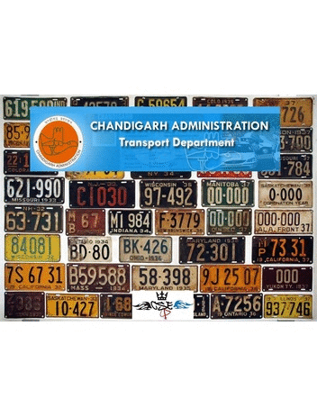

# RLA_Desktop_App
A Java Based Desktop Application for [Registration &amp; Licensing Authority of Chandigarh](http://chdtransport.gov.in/Main.aspx) built in Summer Internship training at Society for Promotion of IT in Chandigarh ([SPIC](http://www.spicindia.com/)).

#### About This project
> This project was initiated to bring together the services of the entire department under one single umbrella and give citizens of Chandigarh a **multi-service-single-window** experience. It has user-friendly menu driven environment to ease the use of the system. 

> Project is combination of two technologies namely JAVA, SQL SERVER. 
> This project begins with a welcome page showing the Chandigarh Administration Transport Department. It then displays various menus each describing different ways for registration of vehicle and also for applying for driving license.

> We also defined the objectives of our project, goals, scopes and problem statement so that we can complete the project easily referring to it.

### Project Learnings
1. SQL Server Connection
2. Databse Handling
3. Login
4. Data Upload (Images/PDF/Docs)
5. Designing Forms

### Setup Details:
1. Editor Netbeans for Java (preferably)
2. SQL Server (ver. 12 minimum for compatibility with jdbc driver)
3. JDK Version 13 or above
4. JDBC Driver (mssql-jdbc-8.2.2.jre13) [Compatability Check for SQL Server](https://docs.microsoft.com/en-us/sql/connect/jdbc/microsoft-jdbc-driver-for-sql-server-support-matrix?view=sql-server-ver15)
5. Other Drivers like org.apache.commons.io (Attached in Repo) 
6. Database Tables for Storing Data & Login (Attached in Repo)

### Other Contributors:
1) [Ankit Bhasin](https://www.linkedin.com/in/ankit-bhasin-5a71684b/)
2) [Akshay Prabhakar](https://www.linkedin.com/in/akshay-kp/)

#### App Glimpse

